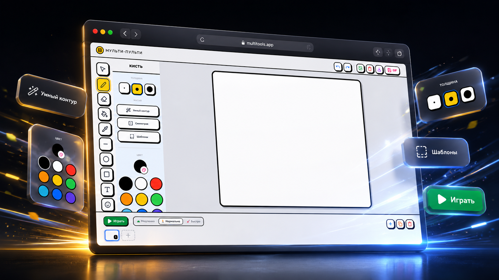

# Мульти-Пульти

<div align="center">

Веб-редактор для рисования и покадровой анимации прямо в браузере.

[Возможности](#возможности) · [Быстрый старт](#быстрый-старт) · [Сборка](#сборка) · [Деплой](#деплой)

</div>

<p align="center">
  
</p>

## О проекте

Мульти-Пульти - это простая веб-студия для создания рисунков и коротких покадровых анимаций. Приложение работает на HTML5 Canvas, хранит прогресс в браузере и не требует серверной части для базового использования.

Интерфейс рассчитан на быстрый творческий процесс: слева находятся инструменты рисования и настройки, по центру расположен холст, снизу - таймлайн кадров и управление воспроизведением.

## Возможности

- Рисование кистью с выбором толщины.
- Ластик, заливка и пипетка для работы с цветом.
- Палитра базовых, недавних и избранных цветов.
- Инструменты фигур: линия, круг и прямоугольник.
- Добавление текста на холст.
- Режим умного контура для более аккуратных линий.
- Симметричное рисование.
- Шаблоны для быстрого старта рисунка.
- Покадровая анимация с добавлением, копированием, удалением и перестановкой кадров.
- Просмотр анимации с настройкой скорости.
- Экспорт результата в PNG и GIF.
- Автосохранение текущей работы в localStorage.
- Базовая проверка содержимого кадра перед сохранением.

## Технологии

- React 19
- TypeScript
- Vite 6
- Tailwind CSS 4
- HTML5 Canvas
- gifenc
- lucide-react

## Быстрый старт

Требования:

- Node.js 20 или новее
- npm

Установка и запуск:

```bash
npm install
npm run dev
```

После запуска приложение будет доступно по адресу:

```text
http://localhost:3000
```

## Сборка

Проверка типов:

```bash
npm run lint
```

Production-сборка:

```bash
npm run build
```

Предпросмотр собранной версии:

```bash
npm run preview
```

## Структура проекта

```text
.
├── src
│   ├── App.tsx
│   ├── index.css
│   ├── main.tsx
│   └── utils
│       ├── audio.ts
│       ├── cn.ts
│       ├── contentFilter.ts
│       ├── extractObject.ts
│       ├── floodFill.ts
│       ├── gifExport.ts
│       └── shapeDetection.ts
├── assets
│   ├── multi-pulti-banner.png
├── index.html
├── package.json
├── render.yaml
├── tsconfig.json
└── vite.config.ts
```

## Деплой

В репозитории уже есть конфигурация для Render:

```yaml
buildCommand: npm install && npm run build
staticPublishPath: ./dist
```

Для другого статического хостинга достаточно собрать проект командой `npm run build` и опубликовать содержимое папки `dist`.

## Лицензия

Проект распространяется под лицензией MIT. Подробности указаны в файле [LICENSE](LICENSE).
